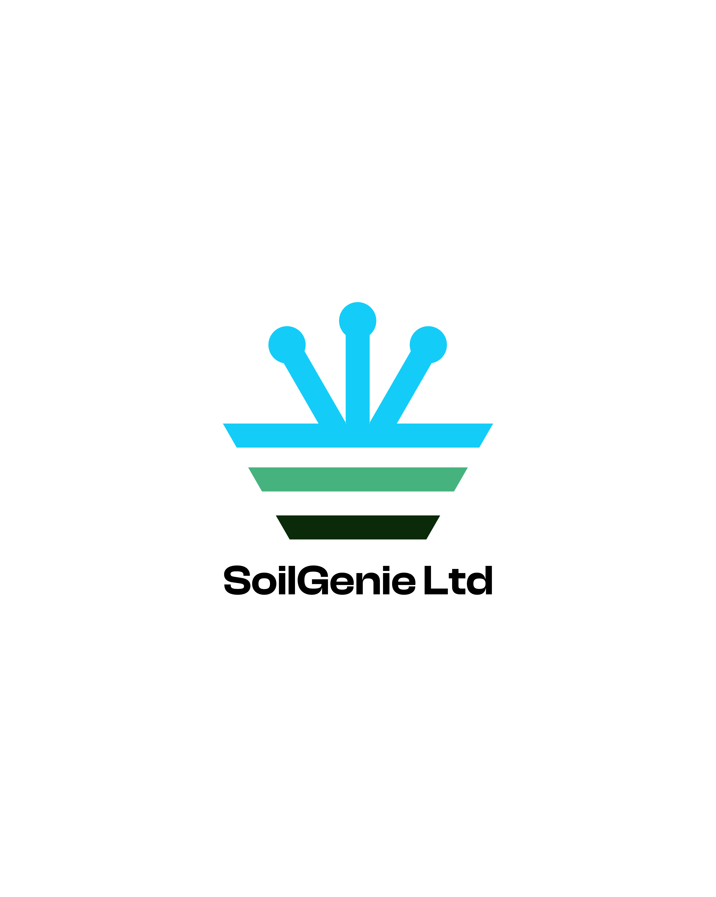

# SoilGenie Web Application

 <!-- Add your logo here -->

AI-powered agricultural platform providing soil analysis, fertilizer recommendations, and weather forecasts for farmers in Nigeria.

## Table of Contents

- [Introduction](#introduction)
- [Features](#features)
- [Technology Stack](#technology-stack)
- [Setup and Installation](#setup-and-installation)
- [Usage](#usage)
- [Contributing](#contributing)
- [License](#license)

## Introduction

SoilGenie is a web-based platform designed to empower Nigerian farmers with data-driven insights. By leveraging public satellite imagery, geospatial data, and machine learning, SoilGenie provides affordable and accessible tools to increase crop yields, reduce fertilizer waste, and promote sustainable farming practices.

## Features

- **AI-Powered Soil Analysis:** Get instant predictions for key soil properties like Nitrogen content, pH, and Organic Carbon without lab tests.
- **Personalized Fertilizer Recommendations:** Receive specific fertilizer advice tailored to your farm's soil and crop type.
- **Hyperlocal Weather Forecasts:** Access daily and weekly weather forecasts for your exact farm location.
- **Interactive Farm Mapping:** Securely save and manage your farm boundaries using an intuitive map interface.
- **User Authentication:** Private user accounts to manage personal farms and data securely.

## Technology Stack

- **Backend:** Python, Flask
- **Frontend:** HTML, CSS, JavaScript, Leaflet.js
- **Database:** SQLite
- **Geospatial & AI:** Google Earth Engine API, Scikit-learn, GeoPandas
- **Deployment:** (e.g., PythonAnywhere, Heroku, AWS)

## Setup and Installation

To run this project locally, follow these steps:

1.  **Clone the repository:**
    ```bash
    git clone https://github.com/[YourUsername]/soilgenie-app.git
    cd soilgenie-app
    ```

2.  **Create and activate a virtual environment:**
    ```bash
    python -m venv venv
    source venv/bin/activate  # On Windows, use `venv\Scripts\activate`
    ```

3.  **Install the dependencies:**
    ```bash
    pip install -r requirements.txt
    ```

4.  **Set up the database:**
    ```bash
    python database_setup.py
    ```

5.  **Run the application:**
    ```bash
    flask run
    ```
    The application will be available at `http://127.0.0.1:5000`.

## Usage

After installation, you can access the application in your browser.
1. Visit the landing page.
2. Register for a new account.
3. Log in to your dashboard.
4. Add a new farm by drawing its boundary on the map.
5. Click "Analyze" to receive your personalized soil report and recommendations.

## Contributing

We welcome contributions to SoilGenie! Please see our `CONTRIBUTING.md` file for guidelines on how to contribute to the project. (You can create this file later).

## License

This project is licensed under the MIT License. See the [LICENSE](LICENSE) file for details.
